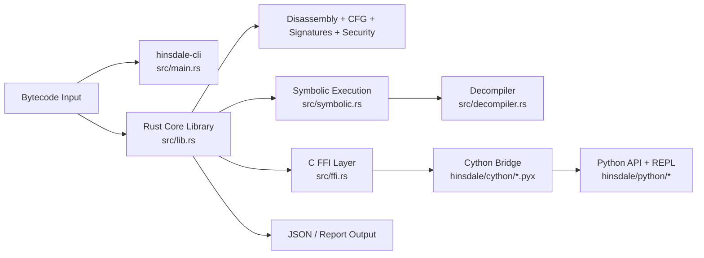

# flowx

Hybrid Rust + Python EVM analysis stack (Hinsdale) with CLI, FFI, and Python integration.

## Hybrid architecture (Mermaid)

## Hinsdale scaffolding

- Rust core: `/home/runner/work/flowx/flowx/hinsdale/src`
- Cython bridge: `/home/runner/work/flowx/flowx/hinsdale/cython`
- Python API + REPL: `/home/runner/work/flowx/flowx/hinsdale/python`
- Tests/benchmarks: `/home/runner/work/flowx/flowx/hinsdale/tests`
